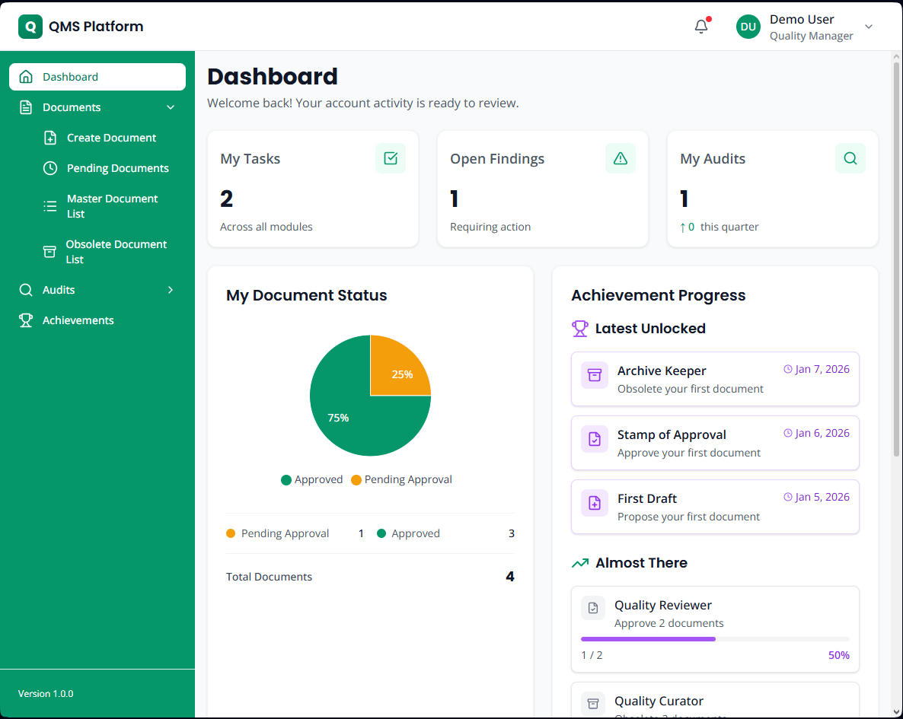
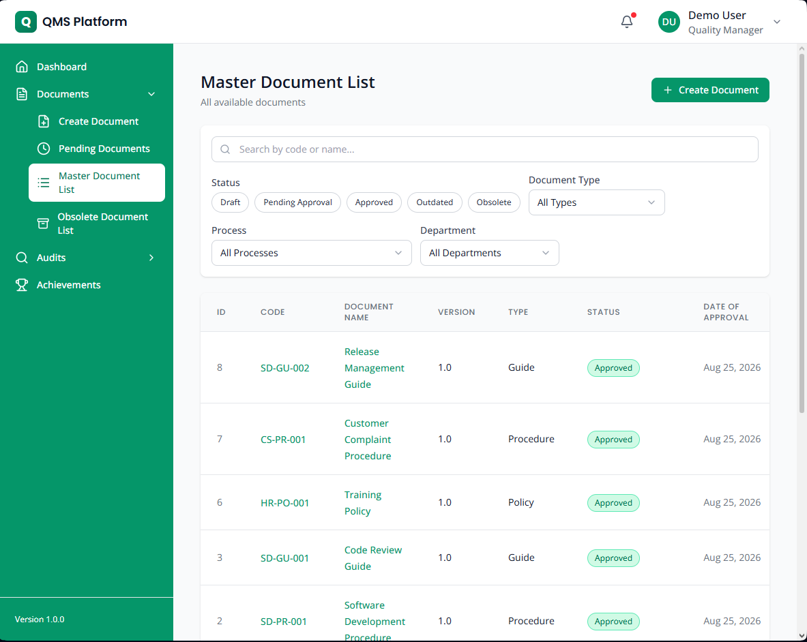
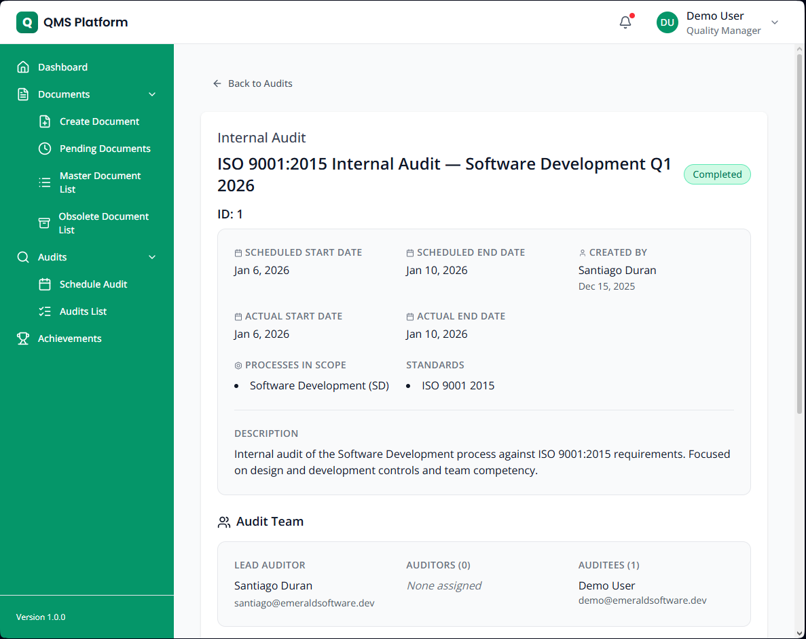
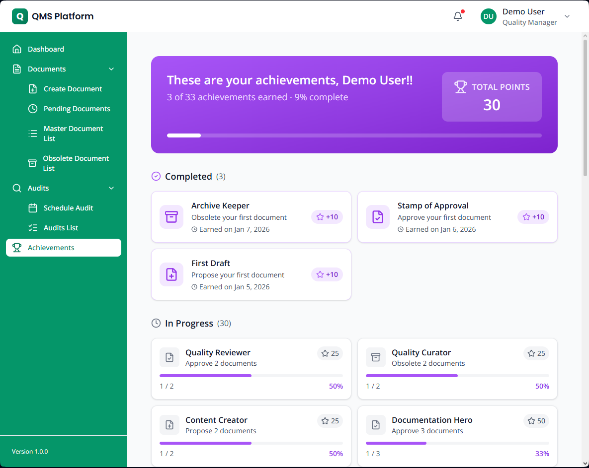
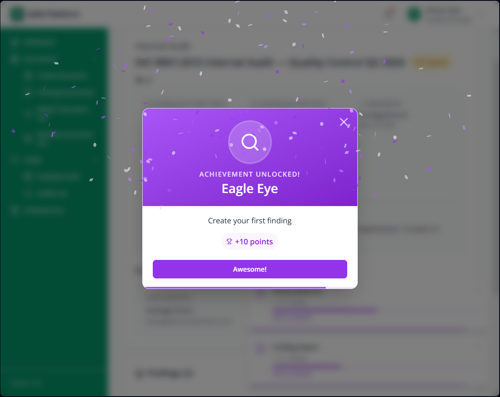

# QMS Platform

## Description

QMS Platform is a web application that helps organizations manage ISO 9001:2015 compliance, tracking documents, audits, findings and corrective actions through their full lifecycle. The application is designed to motivate users with an achievements system and points per each relevant activity performed (gamification).

**Live demo:** [qms.sduran.dev](https://qms.sduran.dev)  
**Demo login:** `demo@emeraldsoftware.dev` / `Demo123!`

---



---

## Features

The system covers three main workflows:

- **Document control:** upload procedures, guides and policies, route them through an approval workflow, and maintain version history.

- **Audit management:** schedule internal audits, assign teams with specific roles (lead auditor, auditor, auditee), run the audit, and record findings against ISO 9001:2015 clauses. Each corrective action goes through its own approval and verification workflow before closing.

- **Achievements:** a gamification layer that tracks user activity across the system and awards trophies for completing meaningful actions like approving their first document or closing their first finding.

---

## Screenshots

| Documents | Audit Detail |
|-----------|-------------|
|  |  |

| Achievements | Unlock Animation |
|-------------|-----------------|
|  |  |

---

## Tech stack

**Frontend**
- Next.js 16 (App Router)
- TypeScript
- Tailwind CSS
- React Hook Form + Zod for validation
- Recharts for dashboard charts

**Backend**
- Node.js (Express) 
- Sequelize ORM
- PostgreSQL
- JWT authentication
- Multer

**Infrastructure**
- Vercel (frontend)
- Render (backend)
- Supabase (database + file storage)
- GitHub Actions (weekly demo reset)

---

## Running locally

**Requirements:** Node.js 18+, PostgreSQL, a Supabase account (for file storage)

```bash
# 1) Clone
git clone https://github.com/sduran-ing/quality-management-platform.git
cd quality-management-platform
npm run install:all

# 2) Backend
cd backend
cp .env.example .env        # fill in your values (local or online DB available)
npm run migrate
npm run seed

# 3) Main folder
cd quality-management-platform
npm run dev                 # runs internally: cd backend && npm start & cd frontend && npm run dev

# 4) Open in browser the client
http://localhost:3000
```

The seed data creates a fictional company (Emerald Software Inc) with users and demo information.

---

## Questions

Contact me by email
Email: [sduran.ing@gmail.com](mailto:sduran.ing@gmail@gmail.com)   
LinkedIn: [LinkedIn](https://www.linkedin.com/in/santiago-duran13/)

---

## License

MIT